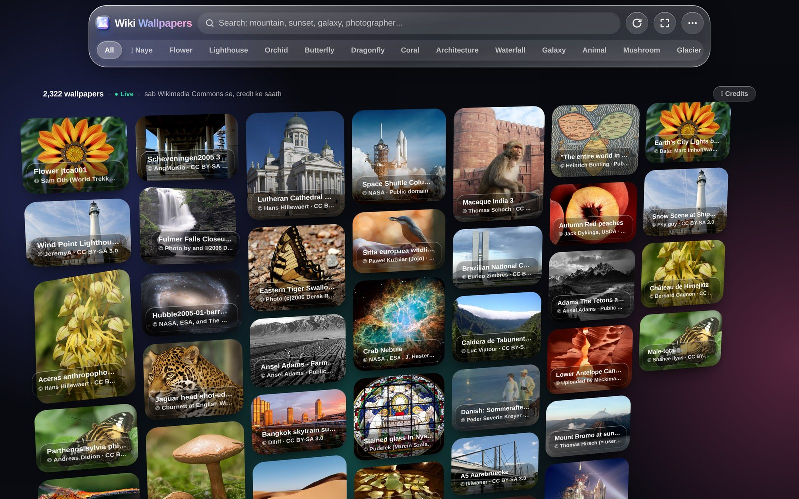
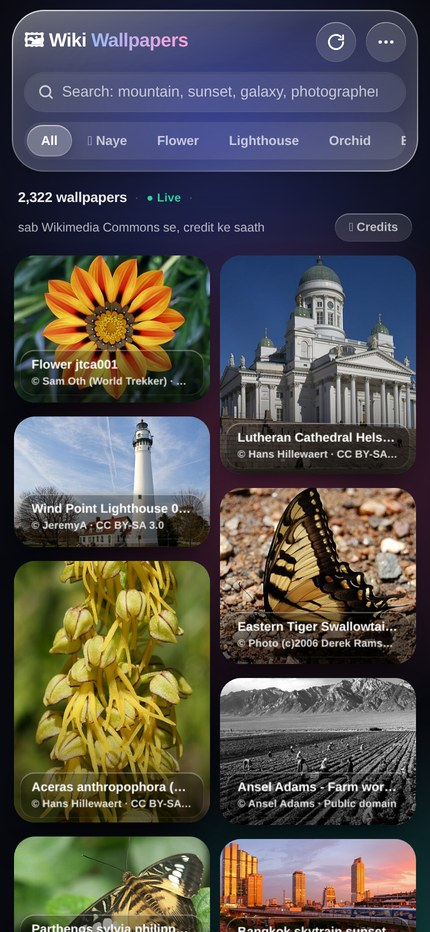
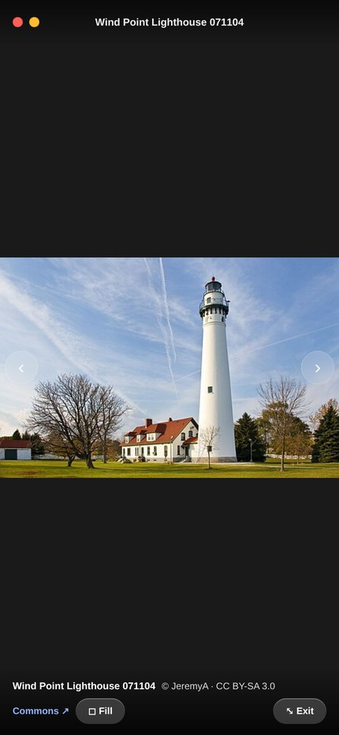
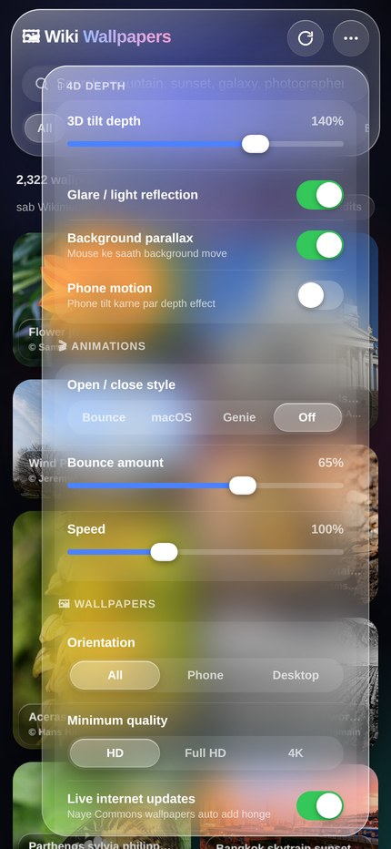
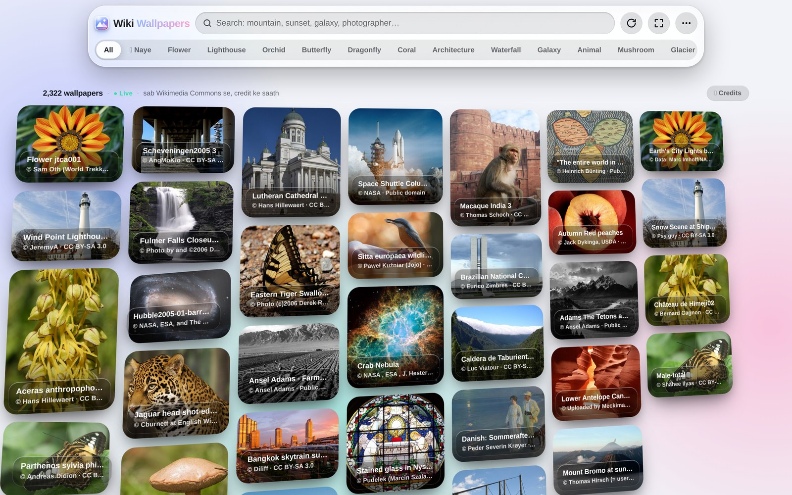

<div align="center">


# Wiki Wallpapers 4D

## ☕ Donate / Buy me a coffee

**Coming soon** — our donation options are on the way.

| Platform | Status |
| --- | --- |
| Paytm | Coming soon |
| PayPal | Coming soon |
| GPay (Google Pay) | Coming soon |

If you like our work, you can support us with a donation. We are bringing this very soon — **coming soon**.

---

## 🌐 Donate / Buy me a coffee — all languages

**Coming soon** · Paytm · PayPal · GPay — all coming soon.

**🇮🇳 Indian languages**

- **Hindi** (हिन्दी): ☕ Donate / Buy me a coffee — जल्द ही आ रहा है। Paytm, PayPal और GPay जल्द ही आ रहे हैं। अगर आपको हमारा काम पसंद है, तो आप डोनेशन देकर हमारा सपोर्ट कर सकते हैं। हम इसे बहुत जल्द ला रहे हैं।
- **Bengali** (বাংলা): ☕ Donate / Buy me a coffee — খুব শিগগিরই আসছে। Paytm, PayPal এবং GPay খুব শিগগিরই আসছে। আমাদের কাজ ভালো লাগলে, আপনি অনুদান দিয়ে আমাদের পাশে দাঁড়াতে পারেন। আমরা খুব তাড়াতাড়ি এটা নিয়ে আসছি।
- **Marathi** (मराठी): ☕ मला कॉफी दान करा / माझ्यासाठी कॉफी विकत घ्या — लवकरच येत आहे. Paytm, PayPal आणि GPay लवकरच येत आहेत. जर तुम्हाला आमचं काम आवडत असेल, तर तुम्ही आम्हाला देणगी देऊन सपोर्ट करू शकता. आम्ही हे लवकरच सुरू करत आहोत.
- **Telugu** (తెలుగు): ☕ నాకు కాఫీ కొనివ్వండి / విరాళం ఇవ్వండి — త్వరలో రాబోతోంది. Paytm, PayPal మరియు GPay త్వరలో రాబోతున్నాయి. మా పని మీకు నచ్చితే, మీరు విరాళం ఇవ్వడం ద్వారా మాకు మద్దతు ఇవ్వవచ్చు. దీన్ని మేము త్వరలోనే తీసుకువస్తున్నాము.
- **Tamil** (தமிழ்): ☕ எனக்கு ஒரு காபி வாங்கிக் கொடுங்கள் / நன்கொடை — விரைவில் வருகிறது. Paytm, PayPal மற்றும் GPay விரைவில் வரவுள்ளன. எங்களுடைய வேலை உங்களுக்குப் பிடித்திருந்தால், நன்கொடை அளித்து நீங்கள் எங்களுக்கு ஆதரவளிக்கலாம். இதை நாங்கள் விரைவில் கொண்டு வருகிறோம்.
- **Gujarati** (ગુજરાતી): ☕ મને કોફી દાન કરો / કોફી ખરીદો — ટૂંક સમયમાં આવી રહ્યું છે. Paytm, PayPal અને GPay ટૂંક સમયમાં આવી રહ્યા છે. જો તમને અમારું કામ ગમે, તો તમે અમને દાન આપીને સપોર્ટ કરી શકો છો. અમે તેને બહુ જલ્દી લાવી રહ્યા છીએ.
- **Kannada** (ಕನ್ನಡ): ☕ ಡೊನೇಟ್ / ನನಗೆ ಒಂದು ಕಾಫಿ ಕೊಡಿಸಿ — ಶೀಘ್ರದಲ್ಲೇ ಬರುತ್ತಿದೆ. Paytm, PayPal ಮತ್ತು GPay ಶೀಘ್ರದಲ್ಲೇ ಬರಲಿವೆ. ನಿಮಗೆ ನಮ್ಮ ಕೆಲಸ ಇಷ್ಟವಾದರೆ, ನೀವು ದೇಣಿಗೆ ನೀಡುವ ಮೂಲಕ ನಮಗೆ ಬೆಂಬಲ ನೀಡಬಹುದು. ನಾವು ಇದನ್ನು ಬಹಳ ಶೀಘ್ರದಲ್ಲೇ ತರುತ್ತಿದ್ದೇವೆ.
- **Malayalam** (മലയാളം): ☕ Donate / Buy me a coffee — ഉടൻ വരുന്നു. Paytm, PayPal, GPay എന്നിവ ഉടൻ വരുന്നു. ഞങ്ങളുടെ വർക്കുകൾ നിങ്ങൾക്ക് ഇഷ്ടമാണെങ്കിൽ, ഒരു സംഭാവന നൽകി ഞങ്ങളെ പിന്തുണയ്ക്കാം. ഞങ്ങൾ ഇത് വളരെ വേഗം കൊണ്ടുവരുന്നുണ്ട്.
- **Odia** (ଓଡ଼ିଆ): ☕ ମୋତେ କଫି କିଣି ଦିଅନ୍ତୁ / ଡୋନେଟ୍ କରନ୍ତୁ — ଖୁବ୍ ଶୀଘ୍ର ଆସୁଛି। Paytm, PayPal ଏବଂ GPay ଖୁବ୍ ଶୀଘ୍ର ଆସୁଛି। ଯଦି ଆପଣଙ୍କୁ ଆମ କାମ ପସନ୍ଦ, ତେବେ ଆପଣ ଆମକୁ ଡୋନେସନ୍ ଦେଇ ସପୋର୍ଟ କରିପାରିବେ। ଆମେ ଏହାକୁ ଖୁବ୍ ଶୀଘ୍ର ଆଣିବୁ।
- **Punjabi** (ਪੰਜਾਬੀ): ☕ ਮੈਨੂੰ ਕੌਫੀ ਦਾਨ ਕਰੋ / ਮੇਰੇ ਲਈ ਕੌਫੀ ਖਰੀਦੋ — ਜਲਦੀ ਆ ਰਿਹਾ ਹੈ। Paytm, PayPal ਅਤੇ GPay ਜਲਦੀ ਆ ਰਹੇ ਹਨ। ਜੇਕਰ ਤੁਹਾਨੂੰ ਸਾਡਾ ਕੰਮ ਪਸੰਦ ਹੈ, ਤਾਂ ਤੁਸੀਂ ਦਾਨ ਦੇ ਕੇ ਸਾਡਾ ਸਾਥ ਦੇ ਸਕਦੇ ਹੋ। ਅਸੀਂ ਇਸਨੂੰ ਬਹੁਤ ਜਲਦੀ ਲੈ ਕੇ ਆ ਰਹੇ ਹਾਂ।
- **Assamese** (অসমীয়া): ☕ Donate / Buy me a coffee — অতি সোনকালেই আহি আছে। Paytm, PayPal আৰু GPay অতি সোনকালেই আহি আছে। যদি আপুনি আমাৰ কাম ভাল পায়, তেন্তে আপুনি দান কৰি আমাক সহায় কৰিব পাৰে। আমি এইটো অতি সোনকালেই লৈ আহি আছোঁ।
- **Urdu** (اردو): ☕ مجھے کافی ڈونیٹ / خریدیں — جلد آرہا ہے۔ Paytm، PayPal اور GPay جلد آرہے ہیں۔ اگر آپ کو ہمارا کام پسند ہے، تو آپ ڈونیشن دے کر ہماری مدد کر سکتے ہیں۔ ہم اسے بہت جلد لا رہے ہیں۔
- **Nepali** (नेपाली): ☕ मलाई कफी किनिदिनुहोस् / दान गर्नुहोस् — छिट्टै आउँदैछ। Paytm, PayPal र GPay पनि छिट्टै आउँदैछन्। यदि तपाईंलाई हाम्रो काम मन पर्छ भने, तपाईंले हामीलाई दान गरेर सहयोग गर्न सक्नुहुन्छ। हामी यो सुविधा धेरै चाँडै ल्याउँदैछौं।
- **Sanskrit** (संस्कृतम्): ☕ मह्यं काफीं क्रीणन्तु / दानं कुर्वन्तु — शीघ्रमेव आगच्छति। Paytm, PayPal तथा GPay अपि शीघ्रमेव आगच्छन्ति। यदि भवन्तः अस्माकं कार्यं रोचन्ते, तर्हि दानं कृत्वा अस्मान् समर्थयितुं शक्नुवन्ति। वयं तत् शीघ्रमेव आनयामः।
- **Konkani** (कोंकणी): ☕ म्हाका कॉफी दान करात / म्हजे खातीर कॉफी घेयात — रोखडेंच येता. Paytm, PayPal आनी GPay रोखडेंच येतले. तुमकां आमचें काम आवडल्यार, तुमी आमकां देणगी दिवन आदार करूंक शकतात. आमी तें खूब बेगीन हाडटात.
- **Maithili** (मैथिली): ☕ हमरा लेल कॉफी डोनेट करू / खरीदू — जल्दिये आबि रहल अछि। Paytm, PayPal आ GPay जल्दिये आबि रहल अछि। जँ अहाँकेँ हमर काज नीक लागैत अछि, तँ अहाँ दान कऽ कऽ हमर समर्थन कऽ सकैत छी। हम एकरा बहुत जल्दी लाबि रहल छी।
- **Kashmiri** (کٲشُر): ☕ مےٚ دِیِو اَکھ کافی — جَلدی یِوان چھُ۔ Paytm, PayPal تہٕ GPay چھِ جَلدی یِوان۔ اَگر تُہؠ سٲنؠ کٲم پَسَند چھِو کَران، تُہؠ ہیٚکِو اَسے اَکھ ڈونیشَن دِتھ سَپورٹ کٔرِتھ۔ اَسؠ چھِ یہِ واریاہ جَلدی اَنان۔
- **Sindhi** (سنڌي): ☕ डोनेट / मूंखे हिक कॉफी वठायो — जल्द अची रह्यो आहे। Paytm, PayPal ऐं GPay जल्द अची रह्या आहिन। जेकडहिं तव्हां खे असां जो कमु वणंदो आहे, त तव्हां असां खे डोनेशन डई सपोर्ट करे सघो था। असीं इहो डाढो जल्द आणी रह्या आहियूं।
- **Dogri** (डोगरी): ☕ डोनेट / मेरे लेई इक कॉफी खरीदो — जल्दी आ करदा ऐ। Paytm, PayPal ते GPay जल्दी आ करदे न। जेकर तुसेंगी साढ़ा कम्म पसंद ऐ, तां तुस साढ़ी मदद दान देइयै करी सकदे ओ। अस इसगी बड़ा जल्दी लेई आ करदे आं।
- **Manipuri** (ꯃꯤꯇꯩ ꯂꯣꯟ): ☕ ꯗꯣꯅꯦꯠ / ꯑꯩꯉꯣꯟꯗꯥ ꯀꯣꯐꯤ ꯑꯃꯥ ꯂꯩꯕꯤꯔꯛꯎ — ꯑꯊꯨꯕꯥ ꯃꯇꯝꯗꯥ ꯂꯥꯛꯀꯅꯤ꯫ Paytm, PayPal ꯑꯃꯁꯨꯡ GPay ꯑꯊꯨꯕꯥ ꯃꯇꯝꯗꯥ ꯂꯥꯛꯀꯅꯤ꯫ ꯀꯔꯤꯒꯨꯝꯕꯥ ꯅꯈꯣꯌꯅꯥ ꯑꯩꯈꯣꯌꯒꯤ ꯊꯕꯛ ꯑꯁꯤ ꯄꯥꯝꯂꯕꯗꯤ, ꯅꯈꯣꯌꯅꯥ ꯗꯣꯅꯦꯁꯟ ꯑꯃꯒꯥ ꯂꯣꯌꯅꯅꯥ ꯑꯩꯈꯣꯌꯕꯨ ꯃꯇꯦꯡ ꯄꯥꯡꯕꯤꯕꯥ ꯌꯥꯏ꯫ ꯑꯩꯈꯣꯌꯅꯥ ꯃꯁꯤ ꯑꯊꯨꯕꯥ ꯃꯇꯝꯗꯥ ꯄꯨꯔꯛꯂꯤ꯫
- **Bodo** (बर’): ☕ आंनो कफि बायना हो — थाबैनो फैगोन। Paytm, PayPal आरो GPay आ थाबैनो फैगोन। जुदि नोंथांमोना जोंनि हाबाखौ मोजां मोनो, नोंथांमोना जोंखौ दान होनानै मदद खालामनो हागोन। जों बेखौ थाबैनो लाबोगोन।
- **Santali** (ᱥᱟᱱᱛᱟᱲᱤ): ☕ ᱫᱟᱱ / ᱤᱧ ᱢᱤᱫ ᱠᱚᱯᱷᱤ ᱠᱤᱨᱤᱧ ᱤᱧ — ᱞᱚᱜᱚᱱ ᱦᱤᱡᱩᱜ ᱠᱟᱱᱟ᱾ Paytm, PayPal ᱟᱨ GPay ᱞᱚᱜᱚᱱ ᱦᱤᱡᱩᱜ ᱠᱟᱱᱟ᱾ ᱡᱩᱫᱤ ᱟᱞᱮᱭᱟᱜ ᱠᱟᱹᱢᱤ ᱯᱮ ᱠᱩᱥᱤᱭᱟᱜ ᱠᱟᱱᱟ, ᱮᱱᱠᱷᱟᱱ ᱫᱟᱱ ᱠᱟᱛᱮ ᱟᱞᱮ ᱜᱚᱲᱚ ᱫᱟᱲᱮᱭᱟᱯᱮᱭᱟ ᱯᱮ᱾ ᱟᱞᱮ ᱱᱚᱶᱟ ᱟᱹᱰᱤ ᱞᱚᱜᱚᱱ ᱞᱮ ᱟᱹᱜᱩᱭᱮᱫᱟ᱾

**🌍 Global languages**

- **Spanish** (Español): ☕ Donar / Invítame un café — Muy pronto. Paytm, PayPal y GPay estarán disponibles muy pronto. Si te gusta nuestro trabajo, puedes apoyarnos con una donación. Lo estamos lanzando muy pronto.
- **French** (Français): ☕ Faire un don / Offrez-moi un café — Bientôt disponible. Paytm, PayPal et GPay arrivent très bientôt. Si vous aimez notre travail, vous pouvez nous soutenir avec un don. Nous le mettons en place très bientôt.
- **German** (Deutsch): ☕ Spenden / Spendier mir einen Kaffee — Bald verfügbar. Paytm, PayPal und GPay kommen sehr bald. Wenn dir unsere Arbeit gefällt, kannst du uns mit einer Spende unterstützen. Wir bringen es sehr bald.
- **Portuguese** (Português): ☕ Doar / Pague-me um café — Em breve. Paytm, PayPal e GPay chegam em breve. Se você gosta do nosso trabalho, pode nos apoiar com uma doação. Estamos trazendo isso muito em breve.
- **Italian** (Italiano): ☕ Dona / Offrimi un caffè — In arrivo. Paytm, PayPal e GPay arrivano presto. Se ti piace il nostro lavoro, puoi sostenerci con una donazione. Lo stiamo lanciando molto presto.
- **Dutch** (Nederlands): ☕ Doneer / Trakteer me op een koffie — Binnenkort beschikbaar. Paytm, PayPal en GPay komen binnenkort. Als je ons werk leuk vindt, kun je ons steunen met een donatie. We brengen dit heel binnenkort.
- **Polish** (Polski): ☕ Przekaż datek / Postaw mi kawę — Wkrótce. Paytm, PayPal i GPay już wkrótce. Jeśli podoba Ci się nasza praca, możesz nas wesprzeć datkiem. Wprowadzamy to bardzo szybko.
- **Russian** (Русский): ☕ Пожертвовать / Купи мне кофе — Скоро. Paytm, PayPal и GPay появятся совсем скоро. Если вам нравится наша работа, вы можете поддержать нас пожертвованием. Мы запускаем это очень скоро.
- **Ukrainian** (Українська): ☕ Пожертвувати / Купи мені каву — Незабаром. Paytm, PayPal і GPay з'являться дуже скоро. Якщо вам подобається наша робота, ви можете підтримати нас пожертвою. Ми запускаємо це дуже скоро.
- **Turkish** (Türkçe): ☕ Bağış yap / Bana bir kahve ısmarla — Çok yakında. Paytm, PayPal ve GPay çok yakında geliyor. İşimizi beğendiyseniz bağışla bizi destekleyebilirsiniz. Çok yakında sunuyoruz.
- **Arabic** (العربية): ☕ تبرّع / اشترِ لي قهوة — قريبًا. Paytm وPayPal وGPay ستتوفر قريبًا جدًا. إذا أعجبك عملنا، يمكنك دعمنا بالتبرع. نطرحه قريبًا جدًا.
- **Persian** (فارسی): ☕ کمک مالی / برایم یک قهوه بخر — به‌زودی. Paytm، PayPal و GPay به‌زودی اضافه می‌شوند. اگر کار ما را دوست دارید، می‌توانید با یک کمک مالی از ما حمایت کنید. این قابلیت را خیلی زود اضافه می‌کنیم.
- **Hebrew** (עברית): ☕ תרומה / קנו לי קפה — בקרוב. Paytm, PayPal ו-GPay יגיעו בקרוב מאוד. אם אתם אוהבים את העבודה שלנו, תוכלו לתמוך בנו בתרומה. אנחנו מביאים את זה בקרוב מאוד.
- **Indonesian** (Bahasa Indonesia): ☕ Donasi / Traktir saya kopi — Segera hadir. Paytm, PayPal, dan GPay segera hadir. Jika Anda menyukai karya kami, Anda dapat mendukung kami dengan donasi. Kami akan menghadirkannya segera.
- **Malay** (Bahasa Melayu): ☕ Derma / Belanja saya kopi — Akan datang. Paytm, PayPal dan GPay akan datang tidak lama lagi. Jika anda suka hasil kerja kami, anda boleh menyokong kami dengan derma. Kami akan membawanya tidak lama lagi.
- **Vietnamese** (Tiếng Việt): ☕ Quyên góp / Mời tôi một ly cà phê — Sắp ra mắt. Paytm, PayPal và GPay sẽ sớm ra mắt. Nếu bạn thích công việc của chúng tôi, bạn có thể ủng hộ bằng một khoản quyên góp. Chúng tôi sẽ sớm mang tính năng này đến.
- **Thai** (ไทย): ☕ บริจาค / เลี้ยงกาแฟฉันสักแก้ว — เร็ว ๆ นี้ Paytm, PayPal และ GPay กำลังจะมาเร็ว ๆ นี้ หากคุณชอบผลงานของเรา คุณสามารถสนับสนุนเราด้วยการบริจาค เรากำลังจะเปิดให้ใช้เร็ว ๆ นี้
- **Japanese** (日本語): ☕ 寄付 / コーヒーをおごる — 近日公開。Paytm、PayPal、GPay も近日対応予定です。私たちの仕事を気に入っていただけたら、寄付で支援できます。まもなく公開します。
- **Korean** (한국어): ☕ 후원 / 커피 한 잔 사주기 — 곧 공개됩니다. Paytm, PayPal, GPay도 곧 지원됩니다. 저희 작업이 마음에 드신다면 후원으로 지원하실 수 있습니다. 곧 선보이겠습니다.
- **Chinese (Simplified)** (简体中文): ☕ 捐赠 / 请我喝杯咖啡 — 即将推出。Paytm、PayPal 和 GPay 即将上线。如果你喜欢我们的作品，可以通过捐赠支持我们。我们很快就会推出。
- **Chinese (Traditional)** (繁體中文): ☕ 捐贈 / 請我喝杯咖啡 — 即將推出。Paytm、PayPal 和 GPay 即將上線。如果你喜歡我們的作品，可以透過捐贈支持我們。我們很快就會推出。
- **Greek** (Ελληνικά): ☕ Δωρεά / Κέρασέ με έναν καφέ — Έρχεται σύντομα. Paytm, PayPal και GPay έρχονται σύντομα. Αν σας αρέσει η δουλειά μας, μπορείτε να μας στηρίξετε με μια δωρεά. Το φέρνουμε πολύ σύντομα.
- **Czech** (Čeština): ☕ Darovat / Kup mi kávu — Již brzy. Paytm, PayPal a GPay budou brzy k dispozici. Pokud se vám naše práce líbí, můžete nás podpořit darem. Přinášíme to velmi brzy.
- **Romanian** (Română): ☕ Donează / Cumpără-mi o cafea — În curând. Paytm, PayPal și GPay vor fi disponibile în curând. Dacă îți place munca noastră, ne poți susține cu o donație. O aducem foarte curând.
- **Hungarian** (Magyar): ☕ Adományozás / Hívj meg egy kávéra — Hamarosan. A Paytm, a PayPal és a GPay hamarosan elérhető. Ha tetszik a munkánk, adománnyal támogathatsz minket. Nagyon hamarosan elhozzuk.
- **Swedish** (Svenska): ☕ Donera / Bjud mig på en kaffe — Kommer snart. Paytm, PayPal och GPay kommer snart. Om du gillar vårt arbete kan du stötta oss med en donation. Vi lanserar det mycket snart.
- **Danish** (Dansk): ☕ Donér / Køb en kaffe til mig — Kommer snart. Paytm, PayPal og GPay kommer snart. Hvis du kan lide vores arbejde, kan du støtte os med en donation. Vi kommer med det meget snart.
- **Norwegian** (Norsk): ☕ Doner / Kjøp en kaffe til meg — Kommer snart. Paytm, PayPal og GPay kommer snart. Hvis du liker arbeidet vårt, kan du støtte oss med en donasjon. Vi lanserer det svært snart.
- **Finnish** (Suomi): ☕ Lahjoita / Tarjoa minulle kahvi — Tulossa pian. Paytm, PayPal ja GPay tulevat pian. Jos pidät työstämme, voit tukea meitä lahjoituksella. Tuomme sen hyvin pian.
- **Swahili** (Kiswahili): ☕ Changia / Ninunulie kahawa — Inakuja hivi karibuni. Paytm, PayPal na GPay zinakuja hivi karibuni. Ikiwa unapenda kazi yetu, unaweza kutusaidia kwa mchango. Tunaileta hivi karibuni.
- **Filipino** (Filipino): ☕ Mag-donate / Bilhan mo ako ng kape — Malapit na. Paparating na ang Paytm, PayPal at GPay. Kung gusto mo ang aming gawa, matutulungan mo kami sa pamamagitan ng donasyon. Ilalabas namin ito sa lalong madaling panahon.


<details>
<summary><b>🌍 Global languages</b></summary>

- **Spanish** (Español): ☕ Donar / Invítame un café — Muy pronto. Paytm, PayPal y GPay estarán disponibles muy pronto. Si te gusta nuestro trabajo, puedes apoyarnos con una donación. Lo estamos lanzando muy pronto.
- **French** (Français): ☕ Faire un don / Offrez-moi un café — Bientôt disponible. Paytm, PayPal et GPay arrivent très bientôt. Si vous aimez notre travail, vous pouvez nous soutenir avec un don. Nous le mettons en place très bientôt.
- **German** (Deutsch): ☕ Spenden / Spendier mir einen Kaffee — Bald verfügbar. Paytm, PayPal und GPay kommen sehr bald. Wenn dir unsere Arbeit gefällt, kannst du uns mit einer Spende unterstützen. Wir bringen es sehr bald.
- **Portuguese** (Português): ☕ Doar / Pague-me um café — Em breve. Paytm, PayPal e GPay chegam em breve. Se você gosta do nosso trabalho, pode nos apoiar com uma doação. Estamos trazendo isso muito em breve.
- **Italian** (Italiano): ☕ Dona / Offrimi un caffè — In arrivo. Paytm, PayPal e GPay arrivano presto. Se ti piace il nostro lavoro, puoi sostenerci con una donazione. Lo stiamo lanciando molto presto.
- **Dutch** (Nederlands): ☕ Doneer / Trakteer me op een koffie — Binnenkort beschikbaar. Paytm, PayPal en GPay komen binnenkort. Als je ons werk leuk vindt, kun je ons steunen met een donatie. We brengen dit heel binnenkort.
- **Polish** (Polski): ☕ Przekaż datek / Postaw mi kawę — Wkrótce. Paytm, PayPal i GPay już wkrótce. Jeśli podoba Ci się nasza praca, możesz nas wesprzeć datkiem. Wprowadzamy to bardzo szybko.
- **Russian** (Русский): ☕ Пожертвовать / Купи мне кофе — Скоро. Paytm, PayPal и GPay появятся совсем скоро. Если вам нравится наша работа, вы можете поддержать нас пожертвованием. Мы запускаем это очень скоро.
- **Ukrainian** (Українська): ☕ Пожертвувати / Купи мені каву — Незабаром. Paytm, PayPal і GPay з'являться дуже скоро. Якщо вам подобається наша робота, ви можете підтримати нас пожертвою. Ми запускаємо це дуже скоро.
- **Turkish** (Türkçe): ☕ Bağış yap / Bana bir kahve ısmarla — Çok yakında. Paytm, PayPal ve GPay çok yakında geliyor. İşimizi beğendiyseniz bağışla bizi destekleyebilirsiniz. Çok yakında sunuyoruz.
- **Arabic** (العربية): ☕ تبرّع / اشترِ لي قهوة — قريبًا. Paytm وPayPal وGPay ستتوفر قريبًا جدًا. إذا أعجبك عملنا، يمكنك دعمنا بالتبرع. نطرحه قريبًا جدًا.
- **Persian** (فارسی): ☕ کمک مالی / برایم یک قهوه بخر — به‌زودی. Paytm، PayPal و GPay به‌زودی اضافه می‌شوند. اگر کار ما را دوست دارید، می‌توانید با یک کمک مالی از ما حمایت کنید. این قابلیت را خیلی زود اضافه می‌کنیم.
- **Hebrew** (עברית): ☕ תרומה / קנו לי קפה — בקרוב. Paytm, PayPal ו-GPay יגיעו בקרוב מאוד. אם אתם אוהבים את העבודה שלנו, תוכלו לתמוך בנו בתרומה. אנחנו מביאים את זה בקרוב מאוד.
- **Indonesian** (Bahasa Indonesia): ☕ Donasi / Traktir saya kopi — Segera hadir. Paytm, PayPal, dan GPay segera hadir. Jika Anda menyukai karya kami, Anda dapat mendukung kami dengan donasi. Kami akan menghadirkannya segera.
- **Malay** (Bahasa Melayu): ☕ Derma / Belanja saya kopi — Akan datang. Paytm, PayPal dan GPay akan datang tidak lama lagi. Jika anda suka hasil kerja kami, anda boleh menyokong kami dengan derma. Kami akan membawanya tidak lama lagi.
- **Vietnamese** (Tiếng Việt): ☕ Quyên góp / Mời tôi một ly cà phê — Sắp ra mắt. Paytm, PayPal và GPay sẽ sớm ra mắt. Nếu bạn thích công việc của chúng tôi, bạn có thể ủng hộ bằng một khoản quyên góp. Chúng tôi sẽ sớm mang tính năng này đến.
- **Thai** (ไทย): ☕ บริจาค / เลี้ยงกาแฟฉันสักแก้ว — เร็ว ๆ นี้ Paytm, PayPal และ GPay กำลังจะมาเร็ว ๆ นี้ หากคุณชอบผลงานของเรา คุณสามารถสนับสนุนเราด้วยการบริจาค เรากำลังจะเปิดให้ใช้เร็ว ๆ นี้
- **Japanese** (日本語): ☕ 寄付 / コーヒーをおごる — 近日公開。Paytm、PayPal、GPay も近日対応予定です。私たちの仕事を気に入っていただけたら、寄付で支援できます。まもなく公開します。
- **Korean** (한국어): ☕ 후원 / 커피 한 잔 사주기 — 곧 공개됩니다. Paytm, PayPal, GPay도 곧 지원됩니다. 저희 작업이 마음에 드신다면 후원으로 지원하실 수 있습니다. 곧 선보이겠습니다.
- **Chinese (Simplified)** (简体中文): ☕ 捐赠 / 请我喝杯咖啡 — 即将推出。Paytm、PayPal 和 GPay 即将上线。如果你喜欢我们的作品，可以通过捐赠支持我们。我们很快就会推出。
- **Chinese (Traditional)** (繁體中文): ☕ 捐贈 / 請我喝杯咖啡 — 即將推出。Paytm、PayPal 和 GPay 即將上線。如果你喜歡我們的作品，可以透過捐贈支持我們。我們很快就會推出。
- **Greek** (Ελληνικά): ☕ Δωρεά / Κέρασέ με έναν καφέ — Έρχεται σύντομα. Paytm, PayPal και GPay έρχονται σύντομα. Αν σας αρέσει η δουλειά μας, μπορείτε να μας στηρίξετε με μια δωρεά. Το φέρνουμε πολύ σύντομα.
- **Czech** (Čeština): ☕ Darovat / Kup mi kávu — Již brzy. Paytm, PayPal a GPay budou brzy k dispozici. Pokud se vám naše práce líbí, můžete nás podpořit darem. Přinášíme to velmi brzy.
- **Romanian** (Română): ☕ Donează / Cumpără-mi o cafea — În curând. Paytm, PayPal și GPay vor fi disponibile în curând. Dacă îți place munca noastră, ne poți susține cu o donație. O aducem foarte curând.
- **Hungarian** (Magyar): ☕ Adományozás / Hívj meg egy kávéra — Hamarosan. A Paytm, a PayPal és a GPay hamarosan elérhető. Ha tetszik a munkánk, adománnyal támogathatsz minket. Nagyon hamarosan elhozzuk.
- **Swedish** (Svenska): ☕ Donera / Bjud mig på en kaffe — Kommer snart. Paytm, PayPal och GPay kommer snart. Om du gillar vårt arbete kan du stötta oss med en donation. Vi lanserar det mycket snart.
- **Danish** (Dansk): ☕ Donér / Køb en kaffe til mig — Kommer snart. Paytm, PayPal og GPay kommer snart. Hvis du kan lide vores arbejde, kan du støtte os med en donation. Vi kommer med det meget snart.
- **Norwegian** (Norsk): ☕ Doner / Kjøp en kaffe til meg — Kommer snart. Paytm, PayPal og GPay kommer snart. Hvis du liker arbeidet vårt, kan du støtte oss med en donasjon. Vi lanserer det svært snart.
- **Finnish** (Suomi): ☕ Lahjoita / Tarjoa minulle kahvi — Tulossa pian. Paytm, PayPal ja GPay tulevat pian. Jos pidät työstämme, voit tukea meitä lahjoituksella. Tuomme sen hyvin pian.
- **Swahili** (Kiswahili): ☕ Changia / Ninunulie kahawa — Inakuja hivi karibuni. Paytm, PayPal na GPay zinakuja hivi karibuni. Ikiwa unapenda kazi yetu, unaweza kutusaidia kwa mchango. Tunaileta hivi karibuni.
- **Filipino** (Filipino): ☕ Mag-donate / Bilhan mo ako ng kape — Malapit na. Paparating na ang Paytm, PayPal at GPay. Kung gusto mo ang aming gawa, matutulungan mo kami sa pamamagitan ng donasyon. Ilalabas namin ito sa lalong madaling panahon.

</details>

---

**2,322 free wallpapers from Wikimedia Commons — liquid-glass UI, 4D depth, live updates, full credits, and a 9-language interface.**

[](#-run-it)
[](../../releases/latest)
[](#-languages)
[](LICENSE)
[](CREDITS.md)



</div>

---

## What it is

A single-file wallpaper app (one HTML file, no build step, no framework) that turns
[Wikimedia Commons](https://commons.wikimedia.org) — the free media library behind Wikipedia —
into a wallpaper feed. Every image carries its photographer, license and source page,
because most of Commons is CC BY / CC BY-SA and **attribution is required**.

The Android app is a thin WebView shell around the exact same HTML, so web and APK
always behave identically.

## Store listing

Ready-to-paste listing copy, icon URL and screenshot URLs for app stores: [`STORE.md`](STORE.md)

## Screenshots

| Mobile feed | Fullscreen viewer | Credits |
|---|---|---|
|  |  |  |

| Language picker | 4D depth settings | Light theme |
|---|---|---|
|  |  |  |

## Languages

Settings → **Language** opens a searchable A–Z picker:

| | | |
|---|---|---|
| English | ગુજરાતી · Gujarati | हिन्दी · Hindi |
| ಕನ್ನಡ · Kannada | മലയാളം · Malayalam | मराठी · Marathi |
| ਪੰਜਾਬੀ · Punjabi | தமிழ் · Tamil | తెలుగు · Telugu |

Switching a language translates **every piece of UI text** — search placeholder, all 61
category chips, the status line, every toast, the image window, the credits sheet, the
whole settings panel and the fullscreen viewer — while **the wallpapers stay exactly the
same**: same photos, same titles, same photographers, same order. The choice is stored in
`localStorage` and restored on the next launch.

## Features

**4D glass UI**
Liquid-glass panels with real refraction (`feDisplacementMap`), a 3D tilt + glare on every
card, parallax backdrop, and optional gyroscope depth on phones. Every knob — blur,
transparency, saturation, corner radius, shine, tilt depth, animation curve and speed —
is live-tweakable from the settings popover and saved to `localStorage`.

**4D app icon**
The launcher icon is a real extruded tile — 26 stacked layers forming the side walls, a
glossy gradient face, a floating photo card behind the glyph and a ground shadow. Inside
the app the same icon tilts in 3D with your pointer (or the gyroscope) with a moving
specular highlight.

**2,322 wallpapers, instantly**
The whole curated library is embedded in the HTML, so the feed opens with zero network
and zero layout shift. 61 categories, mixed portrait/landscape masonry, lazy loading,
infinite scroll — with a throttled scroll listener and an explicit
**“N more wallpapers ↓”** button so the feed can never silently stall.

**Live from Commons**
- 🔄 **Pull down to refresh** — newest featured pictures are fetched and prepended with a `NEW` badge
- 🆕 **"New" chip** — the latest uploads from `Category:Featured pictures on Wikimedia Commons`, newest first
- ⏱️ **Auto-update** — checks every 2.5 minutes and offers a bottom snackbar with the new count
- 🌐 **Live search merged in** — any keyword also queries Commons directly
- ● **Live / ○ Offline** indicator, plus a full offline fallback on the embedded library
- Requests are throttled with exponential back-off and a 429 cool-down, so rapid category
  switching never gets rate-limited

**Fullscreen**
Edge-to-edge viewer with `Fit` / `Fill`, `‹ ›` arrows, `←` `→` keys, swipe navigation,
a credit strip that stays visible, and `Esc` to exit. The whole app also has an
`F` / header-button fullscreen mode.

**Credits, everywhere**
- `© Photographer · License` on every card
- Copy-ready credit line + license + source link in each image's window
- A searchable credits sheet (by photographer, license or title) with **Copy all** and **Credits .txt**
- [`CREDITS.md`](CREDITS.md) — all 2,322 images, one row each

**Made for phones**
A throttled image loader — three downloads at a time, 140 ms apart, with exponential
back-off and a global cool-down when the Wikimedia CDN starts returning `429 Too Many
Requests`. Without it, switching categories quickly got a screenful of broken thumbnails.
Plus `preconnect` to the CDN and a **Performance mode** that lightens blur and effects on
low-RAM devices. Text selection, long-press callouts and the context menu are disabled everywhere
except inputs and links — so holding a card never opens a copy popup.

## Run it

**Web** — open [`index.html`](index.html) in any modern browser. That's it.

**Android** — download `wiki-wallpapers-4d.apk` from the [latest release](../../releases/latest)
and install it (you'll need to allow "install unknown apps" for your browser/file manager).

| | |
|---|---|
| Package | `net.wikiwallpapers.app` |
| Version | 4.8.0 (versionCode 12) |
| Min / Target SDK | 24 (Android 7) / 34 |
| Size | ~525 KB |
| Permissions | Internet, network state, set wallpaper |

## Build the APK

The APK is built **without Gradle** — just `aapt2` + `javac` + `d8` + `apksigner`,
so it builds in seconds and needs no dependency downloads.

```bash
# needs JDK 17 and Android SDK build-tools 34 + platform 34
export ANDROID_SDK=/path/to/android-sdk
export JAVA_HOME=/path/to/jdk-17
cd android && ./build-apk.sh
# → android/build/wiki-wallpapers-4d.apk
```

`android/assets/index.html` is a copy of the root `index.html` — update both when you change the app.

The signing key is committed at `android/tools/keystore.jks`
(store & key password `wikiwallpapers`, alias `wikiwallpapers`) so that future builds
can be installed as an update over this one. Replace it with your own key for a real release.


## Daily maintenance

This project is optimised and bug-fixed **every day** by an automated agent run
(`03:30 IST`). The rules for that job are strict:

- **No UI changes** — no layout, colour, wording, feature or interaction changes
- Only correctness, stability and speed
- Every change is measured or reproduced before it ships (live-CDN harness, Long Tasks API, 429 counters)
- Every change is recorded in [`CHANGELOG.md`](CHANGELOG.md) and shipped as a new signed APK

`tools/setup-build.sh` provisions the JDK + Android SDK pieces the Gradle-free build needs.

## Project layout

```
index.html                  the whole app (UI + data + i18n + logic, single file)
screenshots/                README images
CREDITS.md                  per-image attribution for all 2,322 wallpapers
android/
  AndroidManifest.xml
  src/net/wikiwallpapers/app/MainActivity.java   WebView shell + back-button handling
  res/                                            launcher icons, strings
  assets/index.html                               copy of the app
  build-apk.sh                                    Gradle-free build script
```

## How the data works

The embedded library stores, per image: `i` id, `t` title, `a` artist, `l` license,
`lu` license URL, `p` Commons file page, `th` thumbnail, `w`/`h` size, `d` description,
`c` category. Live results are fetched from the Commons API
(`action=query`, `prop=imageinfo`, `iiprop=url|size|mime|extmetadata`) and normalised into
the same shape, so the UI never cares where an image came from.

The interface strings live in one `I18N` table (131 keys × 9 languages) and are read
through a small `t()` helper, so adding a language means adding one dictionary.

## Credits & license

**Code:** [MIT](LICENSE).

**Images:** each wallpaper keeps its own license from Wikimedia Commons — CC BY-SA 4.0
(1,237), CC BY-SA 3.0 (410), Public domain (203), CC BY 4.0 (139), CC0 (71), and others.
Full attribution for every image is in [`CREDITS.md`](CREDITS.md). Images are loaded from
Wikimedia's servers, not re-hosted. If you repost a wallpaper, keep the credit line.

Built with ❤️ for Wikipedia's photographers.
